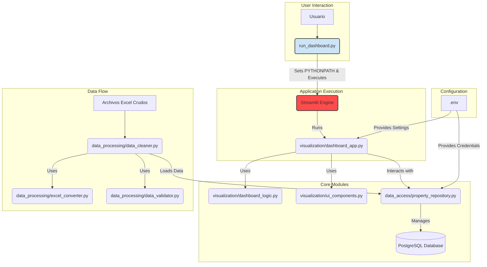
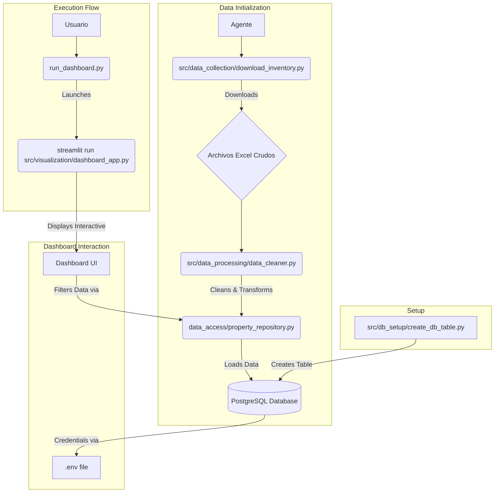
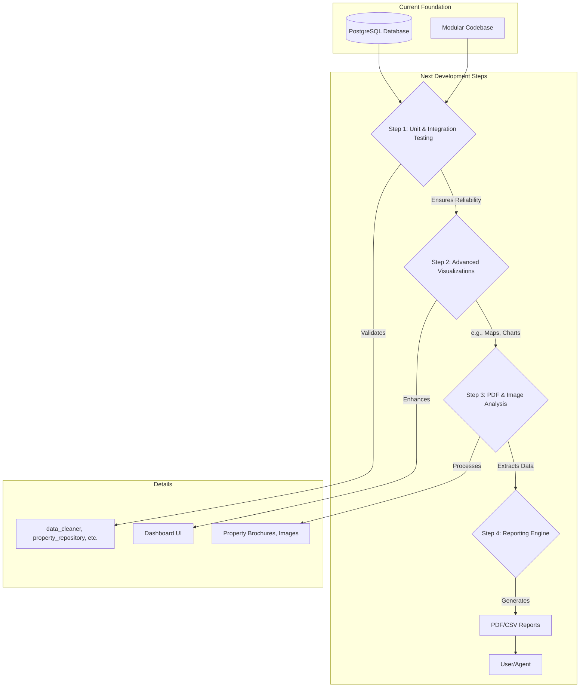

# Automated Real Estate Property Insights

This project aims to build a comprehensive automation to identify real estate properties with high investment potential. The process involves automated data extraction, processing, analysis, and generating a final output with the most relevant properties.

## 🚀 How to Run the Application

To run the main dashboard application, execute the following command from the project root directory:

```bash
python run_dashboard.py
```

This script handles all necessary setup, including configuring the Python path, and launches the Streamlit interactive dashboard.

## 🎯 Project Workflow

The complete automation flow consists of the following steps:

### Step 1: Inventory Data Collection
Automates the login to a real estate portal and downloads the property inventory.

**Script:** `src/data_collection/download_inventory.py`

### Step 2: Data Cleaning, Validation, and Storage
Cleans, transforms, and loads property data into the PostgreSQL database. This logic is now modularized for clarity and maintenance.

**Modules:**
- `src/data_processing/data_cleaner.py`
- `src/data_processing/excel_converter.py`
- `src/data_access/property_repository.py`

### Step 3: Interactive Property Visualization
An interactive Streamlit dashboard to filter and visualize properties based on various criteria.

**Main App:** `src/visualization/dashboard_app.py`

For a detailed discussion on the project's future roadmap, please refer to [docs/next_steps_project_roadmap.md](docs/next_steps_project_roadmap.md).

## 📊 System Diagrams

### 🗺️ Overall System Architecture



### 🚀 Current ETL Process State



### ➡️ Future Development Steps



## ⚙️ Dependencies and Installation

Install the required Python libraries by running:

```bash
pip install -r src/data_collection/requirements.txt
```

### WebDriver
Ensure `chromedriver.exe` (for Google Chrome) matches your browser version and is placed in the `src/data_collection/` directory.

### Database Configuration
Create a `.env` file in the project root with your PostgreSQL credentials. Refer to `.env.example` for the required variables.

To set up the database table, run:
```bash
python src/db_setup/create_db_table.py
```

## ⚠️ Considerations
- **Environment Variables:** Ensure all required variables are set in your `.env` file.
- **WebDriver:** Keep `chromedriver.exe` updated and correctly placed.
- **Web Portal Changes:** The real estate portal's structure may change, requiring script adjustments.