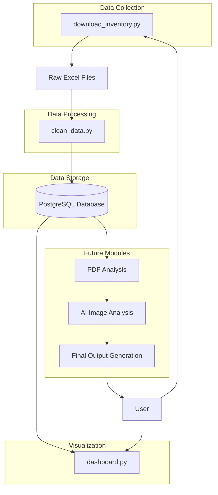

# Automated Real Estate Property Insights

This project aims to build a comprehensive automation to identify real estate properties with high investment potential. The process involves automated data extraction, processing, analysis, and generating a final output with the most relevant properties.

## 🎯 Automation Flow

The complete automation flow consists of the following steps:

### Step 1: Inventory Data Collection (Complete)

This Python script automates the login process to a real estate portal and the download of property inventory in XLS format. It includes interaction with download submenus. The script now also handles automatic conversion of `.xls` files to `.xlsx` for improved data processing compatibility.

**Script location:** `src/data_collection/download_inventory.py`

### Step 2: Data Cleaning, Validation, and Normalization (Complete)

We have defined a detailed PostgreSQL database schema for property data and are now focusing on implementing the data cleaning, validation, and normalization logic. This involves processing the downloaded Excel files, cleaning inconsistencies, normalizing data formats, and preparing data for storage.

**Script location:** `src/data_processing/clean_data.py`

### Step 3: Data Storage (Complete)

This step involves persisting processed data into a PostgreSQL database. The database schema has been designed to support complex queries and future scalability. The `clean_data.py` script now includes functionality to load the cleaned data directly into the `properties` table, handling updates for existing records.

### Step 4: Interactive Property Selection & Visualization (Implemented)

This step involves using a Streamlit dashboard to interactively filter and visualize properties based on user-defined criteria. The dashboard has been enhanced with the following features:

*   **Unified Price Filter:** A single slider for minimum and maximum price, with increments of $50,000. The range is from $500,000 to $20,000,000, with default values of $1,500,000 and $3,500,000 (configurable via `.env`).
*   **Property Status Filter:** Defaults to "enPromocion", with options to include "conIntencion" and "vendidas".
*   **Exclusivity and Option Filter:** Filters properties based on their `tipo_contrato` (e.g., "Exclusiva", "Opcion"), allowing for combined selection.
*   **Minimum Commission Filter:** A numerical input with a default of 3%.
*   **Improved Results Table:**
    *   New "dias_en_mercado" column (days since property was listed).
    *   Rounded values for construction and land meters.
    *   Unified "baños_totales" column (including half-bathrooms).
    *   Removed columns: `latitud`, `longitud`, `codigo_postal`, `comision_compartir_externas`, `cocina`, `fecha_creacion`, `fecha_modificacion`, `apellido_paterno_agente`, `apellido_materno_agente`.
*   **Missing Data Table:** An additional table at the bottom of the dashboard highlights properties with incomplete key fields (e.g., bathrooms, meters, description) for easier review and data completion.

**Dashboard location:** `src/visualization/dashboard.py`

### Future Steps:

For a detailed discussion on the project's future roadmap and next steps, please refer to [docs/next_steps_project_roadmap.md](docs/next_steps_project_roadmap.md).

## 📊 System Diagrams

These diagrams provide a visual roadmap of the Real Estate Insights project, detailing both the current state of implementation and future development steps.

### 🗺️ Overall System Architecture

This diagram illustrates the high-level components of the entire system, from data acquisition to final output.



### 🚀 Current ETL Process State

This diagram details the currently implemented parts of the ETL (Extract, Transform, Load) pipeline, showing the scripts and their interactions.

```mermaid
graph TD
    subgraph Implemented Modules
        A[User/Agent] --> B(src/data_collection/download_inventory.py)
        B --> C{Raw Excel Files<br>src/data_collection/downloads/}
        C --> D(src/data_processing/clean_data.py)
        D -- Cleans & Transforms --> E(PostgreSQL Database)
        E -- Credentials via --> F[.env file]
        E -- Queries --> J(src/visualization/dashboard.py)
        J -- Displays Interactive --> K[Dashboard<br>(Interactive Filters)]
    end

    subgraph Key Interactions
        B -- Downloads --> C
        D -- Loads Data --> E
        E -- Reads Config --> F
        F -- Provides Config --> J
    end

    subgraph Database Setup
        L[src/db_setup/create_db_table.py] --> E
    end
```

### ➡️ Future Development Steps

This diagram outlines the planned future modules and their sequence in the project roadmap.

```mermaid
graph TD
    subgraph Future Development Steps
        DB[(PostgreSQL Database)] --> PA[Step 5: PDF Analysis]
        PA --> AI[Step 6: AI Image Analysis (Optional)]
        AI --> FO[Step 7: Final Output Generation]
        FO --> User[User/Agent]
    end

    subgraph Details
        PA -- Extracts Data --> PDF[Property Brochures (PDF)]
        AI -- Analyzes --> Images[Property Images]
        FO -- Generates --> Reports[Reports/CSV/Dashboards]
    end
```

## ⚙️ Dependencies and Installation

### Data Collection Module (`src/data_collection/download_inventory.py`)

The data collection script requires the following Python library:

*   `selenium`: For browser automation.
*   `python-dotenv`: For loading environment variables from a `.env` file.

To install them, run the following command from the project root:

```bash
pip install -r src/data_collection/requirements.txt
```

#### WebDriver

You will need the browser driver (`chromedriver.exe` for Google Chrome) that matches your Chrome browser version.

1.  **Check your Chrome version:** Open Chrome, go to `chrome://version`, and note the major version (e.g., `126`).
2.  **Download ChromeDriver:** Go to [https://googlechromelabs.github.io/chrome-for-testing/#stable](https://googlechromelabs.github.io/chrome-for-testing/#stable).
3.  Find the ChromeDriver version that matches your Chrome and download the `win64` file (`chromedriver.exe`).
4.  **Place `chromedriver.exe`:** Unzip the downloaded file and place `chromedriver.exe` in the project's `src/data_collection/` directory (`C:\Codeeal_estate_insights\src\data_collection`).

### Database Configuration

For data processing and storage, the project connects to a PostgreSQL database. The connection details are read from environment variables for security and flexibility. You must configure the following environment variables in a `.env` file in the project root before running the data processing scripts.

*   `REI_DB_NAME`: Name of your PostgreSQL database (e.g., `real_estate_db`)
*   `REI_DB_USER`: Username for connecting to the database (e.g., `fm_asesor`)
*   `REI_DB_PASSWORD`: Password for the database user.
*   `REI_DB_HOST`: Host where your PostgreSQL database is running (e.g., `127.0.0.1` for local).
*   `REI_DB_PORT`: Port number for the database connection (e.g., `5432`).
*   `MIN_PRICE`: Default minimum price for the dashboard's price filter (e.g., `1500000`).
*   `MAX_PRICE`: Default maximum price for the dashboard's price filter (e.g., `3500000`).

To set up the database table, run the script located at `src/db_setup/create_db_table.py`.

Refer to `.env.example` for a template of these variables, including property selection parameters.

## 🚀 How to Configure and Run Scripts

### Data Collection Script (`src/data_collection/download_inventory.py`)

1.  **Configure Your Credentials:**
    The script reads the username and password from environment variables for security. You must configure them in your terminal **before running the script**.

    *   **If using CMD:**
        ```cmd
        set C21_USERNAME=YOUR_REAL_USERNAME
        set C21_PSW=YOUR_REAL_PASSWORD
        ```
    *   **If using PowerShell:**
        ```powershell
        $env:C21_USERNAME="YOUR_REAL_USERNAME"
        $env:C21_PSW="YOUR_REAL_PASSWORD"
        ```
    **Ensure you replace `YOUR_REAL_USERNAME` and `YOUR_REAL_PASSWORD` with your actual credentials.**

2.  **Run the Script:**
    Open your terminal, navigate to the script's directory (`C:\Codeeal_estate_insights\src\data_collection`) and run:

    ```bash
    python download_inventory.py
    ```

    The script will create a `downloads` folder in the same directory and save `inventario.xls` there. It will also create a `logs` folder for execution records and a `screenshots` folder for debugging screenshots.

### Data Processing Script (`src/data_processing/clean_data.py`)

This script cleans, transforms, and loads property data into the PostgreSQL database. It uses the database configuration from your `.env` file.

To run it:

```bash
python src/data_processing/clean_data.py
```

### Visualization Script (`src/visualization/dashboard.py`)

This Streamlit application provides an interactive dashboard to visualize the selected properties. It uses the property selection criteria defined in your `.env` file.

To run it:

```bash
streamlit run src/visualization/dashboard.py
```

## ⚠️ Considerations and Common Errors

*   **Environment Variables Not Configured:** If the script does not find required environment variables (e.g., `C21_USERNAME`, `C21_PSW`, or `REI_DB_*`).
    *   **Solution:** Ensure you configure the environment variables in the same terminal session from which you run the script, or correctly set them in your `.env` file.

*   **WebDriver Error:** Issues with `chromedriver.exe` (not found, incorrect version, etc.).
    *   **Solution:** Verify that `chromedriver.exe` is in `src/data_collection/` and its version matches your Chrome. Restart your terminal and try again.

*   **Web Portal Changes:** The real estate portal may change its HTML structure or navigation flow, which might require adjustments to the script.
    *   **Solution:** Review detailed logs in `src/data_collection/logs/` and screenshots in `src/data_collection/screenshots/` to identify the exact point of failure. You might need to adjust XPath selectors in `src/data_collection/download_inventory.py`.

*   **Login Failed:** If the login to the real estate portal fails.
    *   **Causa:** Incorrect credentials, or the website has changed its login process.
    *   **Solution:** Verify your credentials. If they are correct, the website might have implemented new validations or hidden fields. A deeper debugging might be needed.

*   **Database Connection Error:** If the script cannot connect to the PostgreSQL database.
    *   **Solution:** Verify your database credentials in the `.env` file, ensure the PostgreSQL server is running, and check your `pg_hba.conf` file for correct access permissions.

## 💡 Usage Recommendations

*   **Credentials:** Use `.env` files and environment variables for enhanced security.
*   **Maintenance:** Scripts interacting with external websites may require periodic updates due to changes in the web portal.
*   **Responsible Use:** Use this script in accordance with the portal's terms of service.
*   **Debugging:** Logs and screenshots are key tools for troubleshooting.
