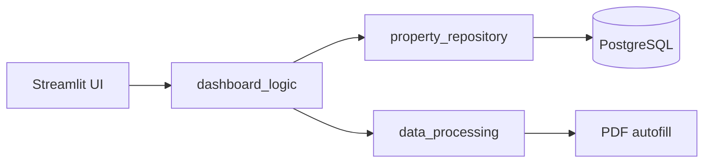

# Arquitectura Modular para Real Estate Insights

Este documento detalla la arquitectura modular implementada en el proyecto Real Estate Insights, con el objetivo de mejorar la legibilidad, simplificar el código, aumentar la reusabilidad y adherirse a las mejores prácticas de programación.

## 1. Principios de Diseño

La arquitectura se basa en los siguientes principios:

*   **Separación de Responsabilidades:** Cada módulo tiene una única responsabilidad bien definida.
*   **Alta Cohesión:** Los elementos dentro de un módulo están fuertemente relacionados.
*   **Bajo Acoplamiento:** Los módulos son independientes entre sí, minimizando dependencias.
*   **Reusabilidad:** Componentes utilizables en diferentes partes del sistema.
*   **Testabilidad:** Facilita la creación de pruebas unitarias.

## 2. Estructura de Directorios Actual

```
C:/Code/real_estate_insights/src/
├──data_access/
│   ├──database_connection.py   # Gestión de conexión a DB
│   └──property_repository.py   # Operaciones CRUD para propiedades
├──data_collection/
│   ├──download_inventory.py    # Descarga de inventario Excel
│   └──download_pdf.py          # Descarga de archivos PDF
├──data_processing/
│   ├──data_cleaner.py         # Limpieza y transformación de datos
│   ├──data_validator.py       # Validación de datos faltantes/inválidos
│   └──excel_converter.py      # Conversión XLS a XLSX
├──db_setup/
│   └──create_db_table.py       # Creación de estructura de DB
├──pdf_templates/
├──scripts/
│   ├──apply_manual_fixes.py    # Aplicación de correcciones manuales
│   └──pdf_autofill.py          # Autollenado de formularios PDF
├──utils/
│   ├──constants.py            # Definición de constantes
│   └──logging_config.py       # Configuración centralizada de logging
└──visualization/
    ├──dashboard_app.py         # Aplicación Streamlit principal (UI)
    └──dashboard_logic.py       # Lógica de negocio del dashboard
```

## 3. Patrones de Diseño Implementados

### a) Patrones Estructurales

*   **Facade (Fachada):**
    *   **Implementación:** `dashboard_app.py` actúa como fachada para la capa de visualización. Orquesta llamadas a `dashboard_logic.py` y `property_repository.py`.
    *   **Beneficio:** Simplifica el uso de subsistemas complejos desde la UI.

### b) Patrones de Comportamiento

*   **Repository (Repositorio):**
    *   **Implementación:** `property_repository.py` abstrae la lógica de acceso a datos.
    *   **Beneficio:** Desacopla lógica de negocio de la persistencia.
    
*   **Command (Comando):**
    *   **Implementación:** Acciones por fila en el dashboard (ej: autofill PDF).
    *   **Beneficio:** Permite encapsular acciones y parametrizar solicitudes.

### c) Patrones Potenciales Futuros

*   **Strategy (Estrategia):** Para algoritmos alternativos de limpieza/validación.
*   **Observer (Observador):** Para notificaciones de cambios en datos.

## 4. Descripción de Módulos

*   **data_access:** Interacción con base de datos
*   **data_collection:** Descarga de datos brutos (Excel, PDF)
*   **data_processing:** Transformación, limpieza y validación de datos
*   **db_setup:** Configuración inicial de base de datos
*   **scripts:** Automatización de tareas específicas (PDF autofill, fixes manuales)
*   **utils:** Utilidades compartidas (constantes, logging)
*   **visualization:** Dashboard Streamlit (UI en `dashboard_app.py`, lógica en `dashboard_logic.py`)

## 5. Relación Frontend-Backend

El flujo de datos sigue este patrón:



*   **Frontend (Streamlit):** `dashboard_app.py` maneja la interfaz de usuario
*   **Backend:** `dashboard_logic.py` orquesta la lógica de negocio
*   **Acceso a datos:** `property_repository.py` gestiona operaciones DB
*   **Procesamiento:** Módulos de `data_processing` y `scripts`

## 6. Dependencias Clave

*   **Externas:** 
    - Streamlit (visualización)
    - SQLAlchemy, psycopg2 (acceso a DB)
    - pandas (procesamiento datos)
    - python-dotenv (gestión variables entorno)
    - pdfrw (autollenado PDF)
    
*   **Internas:**
    - Módulos propios descritos en sección 2

## 7. Automatización

El sistema incluye:

*   Descarga automática de inventario y PDFs
*   Procesamiento y validación de datos
*   Autollenado de formularios PDF
*   Generación de reportes de datos faltantes (`missing_data_view`)